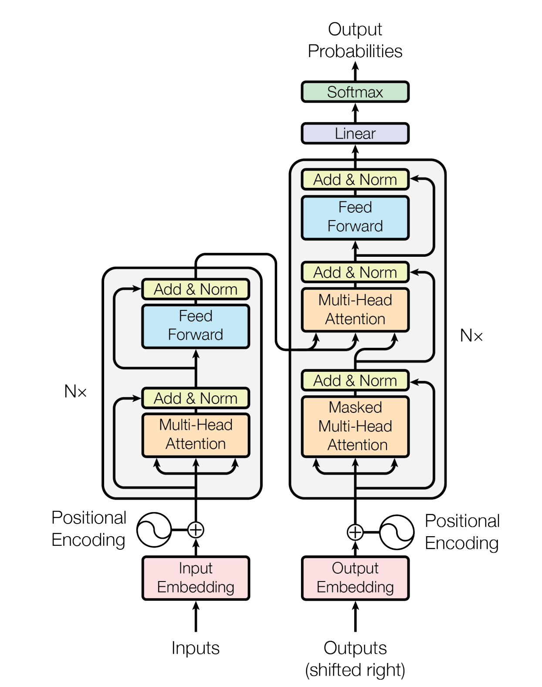

# Transformer Learning Resources 
<!-- ### Understanding the Architecture -->
This repository is for those who are interested in learning about Transformer and how they can be implemented in **Computer Vision** tasks.
As Transformer is still a new architecture, I tried to collect all limited learning resource online and put them here.

I will do my best to update this list down the road. :)

### Blog Post:
0. Inotrduction to `torch.einsum` [[link]](https://rockt.github.io/2018/04/30/einsum) 
1. Great article with graphs for better  understanding (by Jay Alammar) [[link]](http://jalammar.github.io/illustrated-transformer/)
2. Good explanation with step-by-step code (by Peter Bloem) [[link]](http://peterbloem.nl/blog/transformers) [[code]](https://github.com/pbloem/former/tree/master/former) [[video]](https://www.youtube.com/watch?v=KmAISyVvE1Y)
3. PyTorch official tutorial on implementation of Transformer for Seq2Seq task [[link]](https://pytorch.org/tutorials/beginner/transformer_tutorial.html)
4. Tensorflow official tutorial on Transformer model for language understanding [[link]](https://www.tensorflow.org/tutorials/text/transformer)
5. AI Summer- How Transformers work in Deep Learning and NLP: an intuitive introduction [[link]](https://theaisummer.com/transformer/)

### Videos:
1. **Coding from sratch** "PyTorch Transformers from Scratch (Attention is all you need)" [[video]](https://www.youtube.com/watch?v=U0s0f995w14&list=PLJ6JqVWs-N-5kPcEuvY1ZJrmOYAOzuOAw&index=5)
2. **Explaining paper**
     - Attention is All You Need [[video]](https://www.youtube.com/watch?v=iDulhoQ2pro&t=1396s)
     - DETR [[video]](https://www.youtube.com/watch?v=T35ba_VXkMY&t=464s)
     - ViT [[video]](https://www.youtube.com/watch?v=TrdevFK_am4&list=PLJ6JqVWs-N-5kPcEuvY1ZJrmOYAOzuOAw&index=1&t=891s)
3. **Input + Positional embedding** "Visual Guide to Transformer Neural Networks - (Part 1) Position Embeddings" [[video]](https://www.youtube.com/watch?v=dichIcUZfOw&t=655s)

### Papers:
 1. Attention is All You Need (Vaswani et al.) [[paper]](https://papers.nips.cc/paper/2017/file/3f5ee243547dee91fbd053c1c4a845aa-Paper.pdf)
 2. End-to-end Object Detection with Transformer (DETR) (Carion et al.) [[paper]](https://ai.facebook.com/research/publications/end-to-end-object-detection-with-transformers) [[code]](https://github.com/facebookresearch/detr)
 3. An Image is Worth 16x16 Words: Transformers for Image Recognition at Scale (Dosovitskiy et al.) (ViT) [[paper]](https://papers.nips.cc/paper/2017/file/3f5ee243547dee91fbd053c1c4a845aa-Paper.pdf) [[code]](https://github.com/google-research/vision_transformer)
 4. Training data-efficient image transformers & distillation through attention (DeiT) (Touvron et al.) [[paper]](https://arxiv.org/abs/2012.12877) [[code]](https://github.com/facebookresearch/deit)
 5. TransPose: Towards Explainable Human Pose Estimation by Transformer (Yang et al.) [[paper]](https://arxiv.org/pdf/2012.14214.pdf) [[code]](https://github.com/yangsenius/TransPose)
 6. Pyramid Vision Transformer: A Versatile Backbone for Dense Prediction without Convolutions (Wang et al.) [[paper]](https://arxiv.org/pdf/2102.12122v1.pdf) [[code]](https://github.com/whai362/PVT)

### Libraries:
 1. PyTorch [[website]](https://pytorch.org/docs/master/generated/torch.nn.Transformer.html#torch.nn.Transformer)
